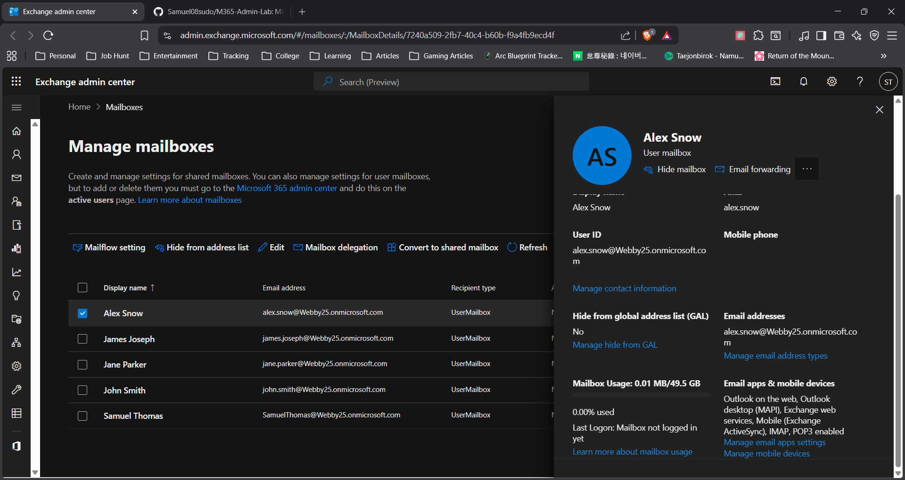

# Email Not Receiving Issue (Exchange Online)

## Problem
User reported not receiving emails.

## Diagnosis
Checked user account in Microsoft 365 Admin Center:
- User account active
- License not assigned

## Root Cause
Mailbox was inactive due to missing Microsoft 365 license.

## Resolution
Assigned Microsoft 365 license to user via Admin Center.

## Result
Mailbox reactivated and email delivery restored successfully.

