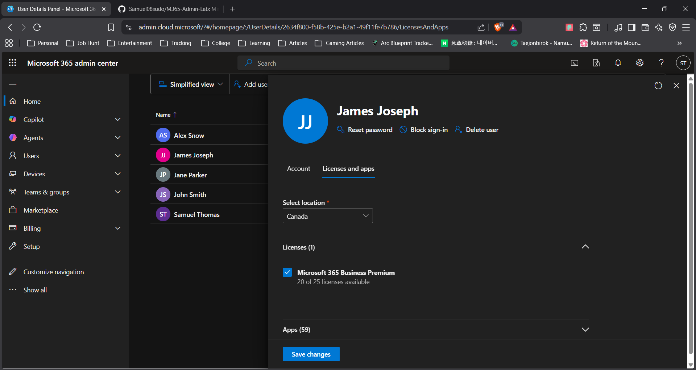

# License Issue Fix (Email Not Working)

## Problem
User reported that they were unable to send or receive emails in Outlook.

## Diagnosis
1. Checked user account status in Microsoft 365 Admin Center
2. Verified that the user account was active
3. Reviewed license assignment and found that no Microsoft 365 license was assigned

## Root Cause
The user’s mailbox was inactive due to a missing Microsoft 365 license.

## Resolution
1. Navigated to the user’s account in Admin Center
2. Assigned the appropriate Microsoft 365 license
3. Saved changes and waited for system update

## Result
Mailbox was reactivated and email functionality was restored successfully.

## Skills Demonstrated
- Troubleshooting email issues
- License management
- Root cause analysis
- Problem resolution in cloud environment

