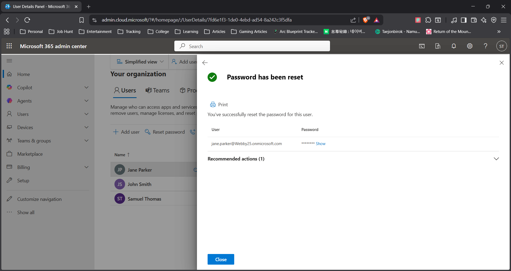

# Password Reset Scenario

## Problem
User was unable to log in to their account due to a forgotten password.

## Steps Performed
1. Navigated to Microsoft 365 Admin Center
2. Selected **Users → Active Users**
3. Chose the affected user account
4. Clicked on **Reset Password**
5. Generated a new temporary password
6. Enabled "Require password change on next login"

## Result
User was able to log in successfully using the new password and regained access to their account.

## Skills Demonstrated
- Account recovery
- Identity management
- IT support troubleshooting

