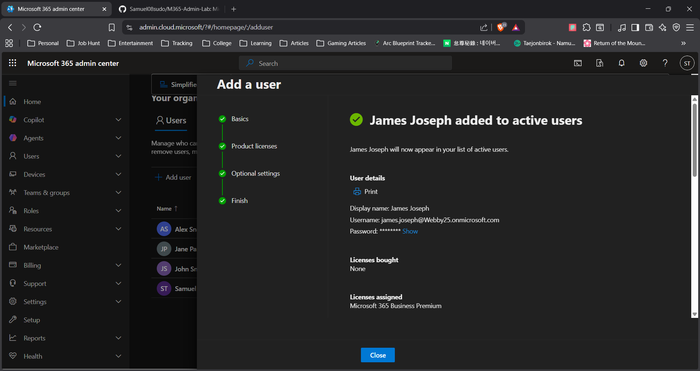

# User Creation in Microsoft 365

## Overview
This task demonstrates how a new user account is created in a Microsoft 365 environment, simulating employee onboarding in a corporate IT setting.

## Steps Performed
1. Navigated to Microsoft 365 Admin Center
2. Selected **Users → Active Users → Add a user**
3. Entered user details (name, username, domain)
4. Assigned a Microsoft 365 license
5. Generated a temporary password for first login

## Result
The new user account was successfully created and granted access to Microsoft 365 services including Outlook, Teams, and OneDrive.

## Skills Demonstrated
- User provisioning
- Access management
- Microsoft 365 administration

